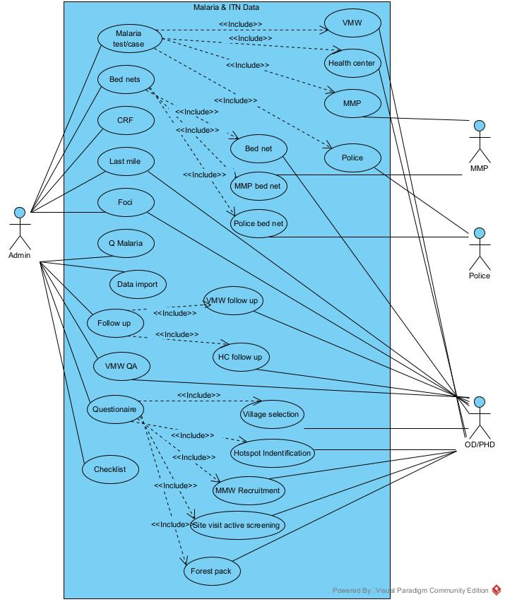
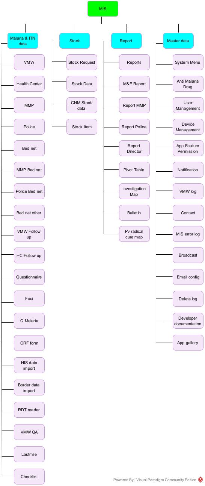

Module
++++++

Use case diagram
================

Use case malaria & ITN data
---------------------------

  Use case for malaria & ITN data

Detail diagram
--------------

  Detail diagram

Malaria & ITN Data
==================

VMW
---

Insert/Update/Delete VMW case

- System: Enter data of malaria case that report by VMW
- Primary Actor: OD staff, PHD staff.
- Scenario: When VMW does not report malaria data by smart phone then OD staff will be responsible for entering data.

Table diagram

::

  +----------------+        +---------------------+
  |                |        |                     | 
  |tblVMWActivity  |--------|tblVMWActivityCases  |
  |                |        |                     |
  +----------------+        +---------------------+  
          |
          |
          |
  +-----------------+
  |                 |
  |tblCensusVillage |
  |                 |
  +-----------------+

- Controller: CaseReport.php (  , ,vmwDeleteReport)

  - ``vmw()`` : view vwm page
  - ``vmwGetPreData()`` get ODs, HFs, Treatments list.
  - ``vmwGetReport()`` get VMWs' villages and reported months list when you select HF.
  - ``vmwGetCase()`` get vmw case report when you click on report month of any village.
  - ``vmwUpdateCase()`` insert/update/delete case.
  
  ::

    if(Rec_ID > 0) 
      then update()
    else if ( Rec_ID < 0 )
      then delete()
    else insert() 

- View: vmwcase_view.php
- ViewModel: VMWCase.js

::

  root
  |
  |__application
  |  |
  |  |__controller
  |  |  |  
  |  |  |__CaseReport.php
  |  |
  |  |__views
  |     |
  |     |__vmwcase_view.php
  |
  |__media
     |
     |__ViewModel
        |
        |__VMWCase.js

HC
---

Insert/Update/Delete HC case

- System: Tool for entering malaria case that report by health center/ referal hospital.
- Actor: OD staff
- Scenario: When HC/RH staff cannot report its case then OD staff will be responsible for entering data.

Table diagram

::

  +---------------+        +------------------+
  |               |        |                  | 
  |tblHFActivity  |--------|tblHFActivityCases|
  |               |        |                  |
  +---------------+        +------------------+  
          |
          |
          |
  +---------------+
  |               |
  |tblHFCodes     |
  |               |
  +---------------+

- Controller: CaseReport.php

  - ``hf()`` : view hf page
  - ``hfGetPreData()`` Treatments list.
  - ``hfGetReport()`` get HF and reported months list when you select OD.
  - ``hfGetCase()`` get HF case report when you click on report month of any HF.
  - ``hfUpdateCase()`` insert/update/delete case.
  
  ::

    if( Rec_ID > 0 ) 
      then update()
    else if ( Rec_ID < 0 )
      then delete()
    else insert() 
- View: hfcase_view.php
- ViewModel: HFCase.js

::

  root
  |
  |__application
  |  |
  |  |__controller
  |  |  |  
  |  |  |__CaseReport.php
  |  |
  |  |__views
  |     |
  |     |__hfcase_view.php
  |
  |__media
     |
     |__ViewModel
        |
        |__HFCase.js

MMP
---

Insert/Update/Delete MMP case

- System: Tool for MMP to enter malaria case.
- Actor: MMP staff.
- Scenario: MMP staff login and go to MMP tool then enter data.

Table diagram

::

  +---------------+        +------------------+
  |               |        |                  | 
  | tblMLActivity |--------|tblMLActivityCases|
  |               |        |                  |
  +---------------+        +------------------+  
          |
          |
          |
  +---------------+
  |               |
  |   tblMLCodes  |
  |               |
  +---------------+

- Controller: CaseReport.php

  - ``ml()`` : view MMP page
  - ``mlGetPreData()`` get region, province and treatments list.
  - ``mlGetReport()`` get group and reported months list when you select province.
  - ``mlGetCase()`` get case report when you click on report month of any group.
  - ``mlUpdateCase()`` insert/update/delete case.
  
  ::

    if ( Rec_ID > 0 ) 
      then update()
    else if ( Rec_ID < 0 )
      then delete()
    else insert()
- View: mlcase_view.php
- ViewModel: MLCase.js

::

  root
  |
  |__application
  |  |
  |  |__controller
  |  |  |  
  |  |  |__CaseReport.php
  |  |
  |  |__views
  |     |
  |     |__mlcase_view.php
  |
  |__media
     |
     |__ViewModel
        |
        |__MLCase.js

Police
------
Insert/Update/Delete Police case

Table diagram

::

  +---------------+        +------------------+
  |               |        |                  | 
  |tblPLActivity  |--------|tblPLActivityCases|
  |               |        |                  |
  +---------------+        +------------------+  
          |
          |
          |
  +---------------+
  |               |
  |tblPLCodes     |
  |               |
  +---------------+

- Controller: CaseReport.php

  - ``pl()`` : view police page
  - ``plGetPreData()`` get province, troop, treatment list.
  - ``plGetReport()`` get post, district, month report list.
  - ``plGetCase()`` get case report when you click on report month.
  - ``plUpdateCase()`` insert/update/delete case.
  
  ::

    if ( Rec_ID > 0 ) 
      then update()
    else if ( Rec_ID < 0 )
      then delete()
    else insert()

- View: plcase_view.php
- ViewModel: PLCase.js

::

  root
  |
  |__application
  |  |
  |  |__controller
  |  |  |  
  |  |  |__CaseReport.php
  |  |
  |  |__views
  |     |
  |     |__plcase_view.php
  |
  |__media
     |
     |__ViewModel
        |
        |__PLCase.js

Bed net
-------

Insert/Update/Delete bed net

Tablet diagram

::

  +-----------------+     +---------------+     +---------------+
  |                 |     |               |     |               |
  | tblCensusVillage|-----| tblMalBedNet  |-----| tblHFCodes    |
  |                 |     |               |     |               |
  +-----------------+     +---------------+     +---------------+

- Controller: CaseReport.php 

  - ``bednet()`` : view bed net page.
  - ``bednetGetReport()`` get groups and month report list.
  - ``bednetGetCase()`` get bed net report when you click on report month.
  - ``bednetUpdateCase()`` insert/update/delete bed net.

  ::

    if ( Rec_ID > 0 ) 
      then update()
    else if ( Rec_ID < 0 )
      then delete()
    else insert()

  - ``bednetDeleteReport()`` delete report.
  
- View: bednet_view.php
- ViewModel: Bednet.js

::

  root
  |
  |__application
  |  |
  |  |__controller
  |  |  |  
  |  |  |__CaseReport.php
  |  |
  |  |__views
  |     |
  |     |__bednet_view.php
  |
  |__media
     |
     |__ViewModel
        |
        |__Bednet.js

MMP bed net
-----------

Insert/Update/Delete MMP bed net

Tablet diagram

::

  +-------------+    +-------------+ 
  |             |    |             | 
  | tblMLBednet |----| tblMLCodes  |     
  |             |    |             | 
  +-------------+    +-------------+ 

- Controller: CaseReport.php 

  - ``bednetML()`` : view MMP bed net page.
  - ``mlGetPreData()`` get region, province and treatments list.
  - ``bednetMLGetReport()`` get groups and month report list.
  - ``bednetMLGetCase()`` get bed net report when you click on report month.
  - ``bednetMLUpdateCase()`` insert/update bed net.

  ::

    if ( Rec_ID == -1 )
      then insert()
    else update()

  - ``bednetMLDeleteReport()`` delete report.
  
- View: mlbednet_view.php
- ViewModel: MLBednet.js

::

  root
  |
  |__application
  |  |
  |  |__controller
  |  |  |  
  |  |  |__CaseReport.php
  |  |
  |  |__views
  |     |
  |     |__mlbednet_view.php
  |
  |__media
     |
     |__ViewModel
        |
        |__MLBednet.js

Police bed net
--------------

Insert/Update/Delete police bed net report

Tablet diagram

::

    +-------------+         +------------------+
    |             |         |                  |
    | tblPLBednet | --------|tblPLTroopCodes   |
    |             |         |                  |
    +-------------+         +------------------+

- Controller: CaseReport.php 

  - ``bednetPL()`` : view police bed net page.
  - ``plGetPreData()`` get province list.
  - ``bednetPLGetReport()`` get troop and month report list.
  - ``bednetPLGetCase()`` get bed net report when you click on report month.
  - ``bednetPLUpdateCase()`` insert/update bed net.

  ::

    if ( Rec_ID == -1 )
      then insert()
    else update()

  - ``bednetPLDeleteReport()`` delete report.
  
- View: plbednet_view.php
- ViewModel: PLBednet.js

::

  root
  |
  |__application
  |  |
  |  |__controller
  |  |  |  
  |  |  |__CaseReport.php
  |  |
  |  |__views
  |     |
  |     |__plbednet_view.php
  |
  |__media
     |
     |__ViewModel
        |
        |__PLBednet.js

Bed net other
-------------

Insert/Update/Delete other bed net report

Tablet diagram

::

    +-------------------+
    |                   |
    | tblMalBednetOther |
    |                   |
    +-------------------+

- Controller: CaseReport.php 

  - ``bednetother()`` : view police bed net page.
  - ``bednetOtherGetReport()`` get troop and month report list.
  - ``bednetOtherUpdateReport()`` insert/update/delete bed net.

::

    if ( Rec_ID > 0 ) 
      then update()
    else if ( Rec_ID < 0 )
      then delete()
    else insert()
  
- View: bednetother_view.php
- ViewModel: BednetOther.js

::

  root
  |
  |__application
  |  |
  |  |__controller
  |  |  |  
  |  |  |__CaseReport.php
  |  |
  |  |__views
  |     |
  |     |__bednetother_view.php
  |
  |__media
     |
     |__ViewModel
        |
        |__BednetOther.js    

Questionaire
------------

tblQuestion11 , tblQuestion12, tblQuestion21, tblQuestion13, tblQuestion22

Annex 1: Village Selection
~~~~~~~~~~~~~~~~~~~~~~~~~~

Table

::

    +---------------+
    |               |
    | tblQuestion11 |
    |               |
    +---------------+

- Controller: Question.php

  - ``index(Q11)`` view page.
  - getData(tblQuestion11) retrieve data.
- Controller: Direct.php

  - ``insert()``
  - ``update()``
  
- View: question11_view.php
- ViewModel: Question11.js

Annex 2: Hotspot Identification
~~~~~~~~~~~~~~~~~~~~~~~~~~~~~~~

Table

::

    +---------------+
    |               |
    | tblQuestion12 |
    |               |
    +---------------+

- Controller: Question.php

  - ``index(Q12)`` view page.
  - getData(tblQuestion12) retrieve data.
- Controller: Direct.php

  - ``insert()``
  - ``update()``
  
- View: question12_view.php
- ViewModel: Question12.js

Annex 4: MMW Recruitment
~~~~~~~~~~~~~~~~~~~~~~~~

Table

::

    +---------------+
    |               |
    | tblQuestion21 |
    |               |
    +---------------+

- Controller: Question.php

  - ``index(Q21)`` view page.
  - getData(tblQuestion21) retrieve data.
- Controller: Direct.php

  - ``insert()``
  - ``update()``
  
- View: question21_view.php
- ViewModel: Question21.js

Annex 5, 6: Site Visit Active Screening
~~~~~~~~~~~~~~~~~~~~~~~~~~~~~~~~~~~~~~~

Table

::

    +---------------+
    |               |
    | tblQuestion13 |
    |               |
    +---------------+

- Controller: Question.php

  - ``index(Q13)`` view page.
  - getData(tblQuestion13) retrieve data.
- Controller: Direct.php

  - ``insert()``
  - ``update()``
  
- View: question13_view.php
- ViewModel: Question13.js

Annex 7: Forest Pack
~~~~~~~~~~~~~~~~~~~~

Table

::

    +---------------+
    |               |
    | tblQuestion22 |
    |               |
    +---------------+

- Controller: Question.php

  - ``index(Q22)`` view page.
  - ``getData(tblQuestion22)`` retrieve data.
- Controller: Direct.php

  - ``insert()``
  - ``update()``
  
- View: question22_view.php
- ViewModel: Question22.js

Foci investigation
------------------

Table v1

::

    +-----------------------+     +-------------------+
    |                       |     |                   |
    | tblFociInvestiation   |-----| tblCensusVillage  |
    |                       |     |                   |
    +-----------------------+     +-------------------+

Table v2

::

    +-----------------------+     +-------------------+
    |                       |     |                   |
    | tblFociInvestiation2  |-----| tblCensusVillage  |
    |                       |     |                   |
    +-----------------------+     +-------------------+

List of foci
~~~~~~~~~~~~

- Controller: Foci.php

  - ``index()`` view page
  - ``getData()`` we use store procedure ``SP_Get_FociList`` 
  - ``getDetail()``
- View: foci_view.php
- ViewModel: Foci.js

Detail of foci v1
~~~~~~~~~~~~~~~~~~

- Controller: Foci.php

  - ``open(village_code)`` to open form of foci v1.
  - ``save1()`` to save data of foci v1.

  ::

    if ( Rec_ID == null )
      then insert()
    else update()

  - ``getPatient()``
- View: foci1_view.php
- ViewModel: Foci1.js

Detail of foci v2
~~~~~~~~~~~~~~~~~~

- Controller: Foci.php

  - ``open(village_code)`` to open form of foci v2.
  - ``save2()`` to save data of foci v2.

  ::

    if ( Rec_ID == null )
      then insert()
    else update()

  - ``getClassify()``
- View: foci1_view.php
- ViewModel: Foci1.js

Follow up
---------

VMW follow up
~~~~~~~~~~~~~

- System: Followup tool for enter VMW followup data.
- Primary actor: OD staff.
- Scenario: When VMW report malaria case with Pv or Mix specie then system will create patient code and write to database and create VMW notification log.
  when patient go to health center to get Pv radical cure then Hc staff update case by adding G6PD result and number of primaquine then system will create follow up form for that patient.
  In case Hc does not enter data then OD staff will be responsible for entering data.

Table

::

  +----------------+
  |                |
  | tblVMWFollowup |
  |                |
  +----------------+

- Controller: VMWFollowup.php

  - ``getData()`` get list of VMW follow up
  - ``getDetail()`` get detail of VMW follow up
  - ``delete()`` delete follow up.
  - ``save()`` insert/update

  ::

    if ( empty (Rec_ID) )
      then insert()
    else update()  
- View: vmwfollowup_view.php
- ViewModel: VMWFollowup.js
  
HC follow up
~~~~~~~~~~~~

- System: Followup tool for enter HF followup data.
- Primary actor: OD staff.
- Scenario: When HC report malaria case with Pv or Mix specie then system will write to database and generate patient code.
  If patient come from Village that has VMW system will create VMW Notificatino, otherwise system will create HC notification.
  If that patient get Pv radical cure service then Hc update case by enter result of G6PD and number of primaquine then system will create follow up form.
  in case Hc staff does not enter followup data in time then OD staff will be responsible for entering data.

Table

::

  +---------------+
  |               |
  | tblHCFollowup |
  |               |
  +---------------+

- Controller: HCFollowup.php

  - ``getData()`` get list of follow up
  - ``getDetail()`` get detail of follow up
  - ``delete()`` delete follow up.
  - ``save()`` insert/update

  ::

    if ( empty (Rec_ID) )
      then insert()
    else update()  
- View: hcfollowup_view.php
- ViewModel: HCFollowup.js

HIS data upload
---------------

Table diagram

::

  +-----------------+     +-----------------+     +-----------------+     +-----------------+
  |                 |     |                 |     |                 |     |                 |
  | tblHisDipstick  |     |    tblHisSlide  |     |   tblHisTreat   |     |    tblHisVMW    |
  |                 |     |                 |     |                 |     |                 |
  +-----------------+     +-----------------+     +-----------------+     +-----------------+

- Controller: HIS.php

  - ``getData()`` get list of his report
  - ``getDetail()`` show detail of report by month
  - ``getReport()`` show report of HIS and MIS
  - ``upload()`` upload excel file of HIS
  - ``delete()`` delete report
- View his_view.php
- ViewModel: HIS.js

Border malaria case upload
--------------------------

Table

::

  +----------------+
  |                |
  | tblBorderCases |
  |                |
  +----------------+

- Controller: BorderImport.php
- View: borderimport_view.php
- ViewModel: BorderImport.js

VMW QA
------

- System: VMW QA tool for OD/PHD monitor VMW.
- Actor: OD , PHD
- Scenario: When HC/OD/PHP use tablet to enter data, then OD/PHD can use this tool to view questionaire, supervision schedule, Monitor, Report, Dashboard.
  
Table diagram

::

  +---------------------+     +---------------------------+     +-------------------------+
  |                     |     |                           |     |                         |
  | tblVMWQuestionnaire |-----| tblVMWQuestionnaireDetail |-----| tblVMWQuestionnaireItem |
  |                     |     |                           |     |                         |
  +---------------------+     +---------------------------+     +-------------------------+

  
- Controller: VMWQA.php
- View: vmwqa_view.php
- ViewModel: VMWQA.js

Lastmile
--------

- System: Last mile 
- Actor: OD/PHD
- Scenario: When VMW cannot enter data, then OD staff will be responsible for entering data.

Table diagram

::

  +----------------------+     +----------------------------+     +----------------+     
  |                      |     |                            |     |                |     
  | tblLastmileHouseHold |----<| tblLastmileHouseHoldMember |----<| tblLastmileTDA |
  |                      |     |                            |     |                |     
  +----------------------+     +----------------------------+     +----------------+
                                  |                   |
                                  |                   |
                          +----------------+    +----------------+
                          |                |    |                |
                          | tblLastmileIPT |    | tblLastmileAFS |
                          |                |    |                |
                          +----------------+    +----------------+

- Controller: Lastmile.php
- View: lastmile_view.php
- ViewModel: Lastmile.js

.. note::

  TDA1 and TDA2 must be 28 days apart.

  Must complete TDA1/TDA2 before do IPT.

  IPT and TDA1 must be 14 days apart.

  IPT and TDA2 must be 28 days apart.

Check list
----------

Check list HC
~~~~~~~~~~~~~
Table diagram

::

  +----------------+      +----------------------+
  |                |      |                      |
  | tblChecklistHC |-----<| tblChecklistHCDetail |
  |                |      |                      |
  +----------------+      +----------------------+

- Controller: Checklist.php
- View: checklist_hc_view.php
- ViewModel: Checklist_HC.js

Check list OD
~~~~~~~~~~~~~

Table diagram

::

  +----------------+      +----------------------+
  |                |      |                      |
  | tblChecklistOD |-----<| tblChecklistODDetail |
  |                |      |                      |
  +----------------+      +----------------------+

- Controller: Checklist.php
- View: checklist_od_view.php
- ViewModel: Checklist_OD.js

Check list EPI
~~~~~~~~~~~~~~

Table diagram

::

  +-----------------+      +-----------------------+
  |                 |      |                       |
  | tblChecklistEPI |-----<| tblChecklistEPIDetail |
  |                 |      |                       |
  +-----------------+      +-----------------------+

- Controller: Checklist.php
- View: checklist_epi_view.php
- ViewModel: Checklist_EPI.js

Stock
=====

Stock request
-------------

Table diagram

::

  +------------+      +------------+
  |            |      |            |
  | tblStockV2 |-----<| tblHFCodes |
  |            |      |            |
  +------------+      +------------+

- Controller: Stock.php

  - ``request()`` view UI of stock request.
  - ``getRequest()`` get stock request data.
  - ``getDetail()`` get detail stock item of hc.
  - ``offer()`` confirm stock offer.
- View: stockrequest_view.php
- ViewModel: StockRequest.js

Stock Data
----------

Stock HC
~~~~~~~~

::

  +------------+      +------------+
  |            |      |            |
  | tblStockV2 |-----<| tblHFCodes |
  |            |      |            |
  +------------+      +------------+

- Controller: Stock.php

  - ``report()`` view UI of stock data.
  - ``getReportHF()`` get month of report.
  - ``getReportDetailHF()`` get detail sotck item data.
  - ``exportExcel()`` export to excel.
  - ``saveStockHF()`` Insert/Update stock data.

  ::

    if (Rec_ID == 0)
      Insert()
    else Update()  

- View: stockreport_view.php
- ViewModel: StockReport.js

Stock OD
~~~~~~~~

::

  +------------+      +------------+
  |            |      |            |
  | tblStockOD |-----<|    tblOD   |
  |            |      |            |
  +------------+      +------------+

- Controller: Stock.php

  - ``report()`` view UI of stock data.
  - ``getReportOD()`` get month of report.
  - ``getReportDetailOD()`` get detail sotck item data.
  - ``exportExcel()`` export to excel.
  - ``saveStockOD()`` Insert/Update stock data.

  ::
    
    if (Rec_ID == 0)
      Insert()
    else Update()  

- View: stockreport_view.php
- ViewModel: StockReport.js

Stock CNM
---------

Table diagram

::

  +-------------+
  |             |
  | tblStockCNM |
  |             |
  +-------------+

- Controller: Stock.php

  - ``report()`` view UI of stock data.
  - ``getReportCNM()`` get month of report.
  - ``getReportDetailCNM()`` get detail sotck item data.
  - ``exportExcel()`` export to excel.
  - ``saveStockCNM()`` Insert/Update stock data.

  ::
    
    if (Rec_ID == 0)
      Insert()
    else Update()  

- View: stockreportcnm_view.php
- ViewModel: StockReportCNM.js  